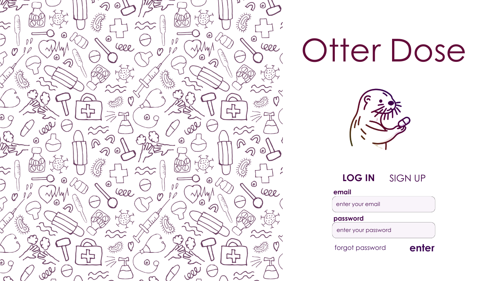
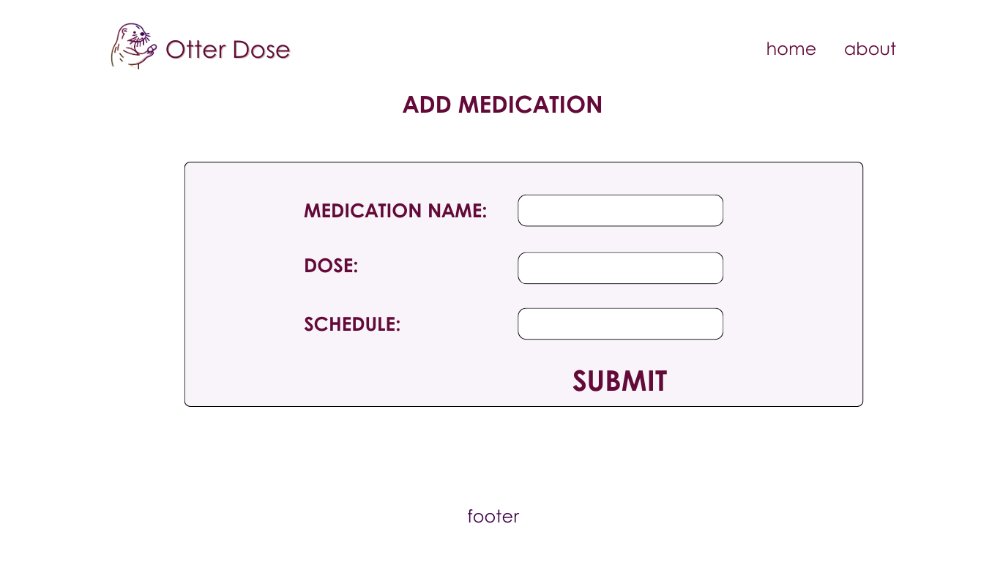

# Project Title

Otter Dose

## Overview

Otter Dose is a responsive web application designed to simplify medication management and improve adherence to prescribed treatments. It empowers individuals to confidently track their medications through a user-friendly interface accessible on tablets, desktops, and mobile devices.

### Problem

Many people struggle to remember to take their medications on schedule, leading to missed doses and potential health complications. Otter Dose tackles this issue by offering a convenient and intuitive solution for managing medications.

### User Profile

- Individuals managing their own medications.
- Caregivers assisting family members who may have difficulty managing medications.
- Parents managing medications for their children.
- Pet owners managing medications for their animals.

### Features

- Effortless Medication Tracking: Track medications with ease, adding details like name, dosage, and schedule.
- Clear Medication Schedule: View a clear and concise schedule of your upcoming medication doses, ensuring you never miss a beat.
- Simplified Intake Confirmation: Confirm medication intake with a click or tap, simplifying your routine.
- Medication History: Access medication history to monitor adherence patterns and track progress.

## Implementation

### Tech Stack

Frontend: HTML, CSS, SASS, JavaScript, React
Backend: Express, Node.js
Database: MySQL
Client-side Libraries: Axios
Server Libraries: Knex, Express

### APIs

- NFC APIs: To enable tap-to-confirm functionality.
- Medical Databases: For fetching medication information.

### Sitemap

- Home Page: Overview of medications, showing if they have been taken today or not
- Medication Detail Page: Detailed view of a specific medication, shows schedule, history, API that shows more info about that medication
- Medication Edit Page: Edit medication details like dose, schedule, etc.
- Register Page: User registration for creating an account.
- Login Page: User login for accessing the application.

### Mockups






### Data

Users: Information about registered users.
Medications: User Id and Details of medications, including name, dose, schedule, and intake history

### Endpoints

User Management:

POST /users (Register Page): Create a new user account.
POST /login (Login Page): Login user and generate JWT token upon successful authentication.

GET "/medications" (Home Page):

- Retrieve a list of medications.

Response:

```
[
    {
        "id": 1,
        "name": "Visanne",
        "dose": "2mg",
        "schedule": "Once a day",
        "lastTaken": "2024-05-27"
        "taken_today": false
    },
    {
        "id": 2,
        "name": "Levothyroxine",
        "dose": "25mcg",
        "schedule": "Once a day",
        "lastTaken": "2024-05-28"
        "taken_today": true
    },

    ...
]
```

GET "/medications/:id" (Medication Detail Page):

- Get medication by ID.

Parameters:

- id: Medication ID

  Response:

  {
  "id": 1,
  "name": "Visanne",
  "dose": "2mg",
  "schedule": "Once a day",
  "lastTaken": "2024-05-27"
  "taken_today": false
  }

POST "/medications" (Medication Add Page):

- Create a new medication entry.

Parameters:

- name: Medication name
- dose: Medication dosage
- schedule: Medication schedule

Response:

{
  "message": "Medication has been created successfully!"
}

PATCH "/medications/:id" (Medication Edit Page):

- Update an existing medication entry.

Parameters:

- id: Medication ID
- name (optional): Updated medication name
- dose (optional): Updated medication dosage
- schedule (optional): Updated medication schedule

Response:

{
  "message": "Medication has been updated successfully!"
}

DELETE "/medications/:id" (Medication Edit Page):

- Delete a medication entry.

Parameters:

- id: Medication ID
  Response:

{
  "message": "Medication has been deleted successfully!"
}

POST "/medications/:id/confirm" (Home Page):

- Confirm medication intake.

Parameters:

-id: Medication ID

Response:

{
  "message": "Medication intake confirmed!"
}

### Auth

Time-Permitting: Otter Dose will utilize JWT (JSON Web Token) authentication for secure user login and access control. Users will create accounts with usernames and passwords. When a user logs in successfully,

## Roadmap

- Sprint 1: Setup and Authentication

1. Set up project structure, repository, and database schema.
1. Set up server structure and repository.


- Sprint 2: Medication Management

1. Develop frontend components for medication tracking, schedule display, and intake confirmation.
2. Create backend endpoints for CRUD operations on medications.

- Sprint 3: User Interface Refinement

1. Implement medication history ◊feature to track adherence patterns.
2. Enhance User Interface: Improve the overall design and layout for better usability and accessibility, ensuring that the application is user-friendly across all devices.
3. Implement user authentication and registration functionality.

- Sprint 4: Testing and Deployment

1. Conduct thorough testing of all features.
2. Address any identified issues and refine user experience.
3. Prepare for deployment and deploy Otter Dose web application.

## Nice-to-haves

Lab Tracker:

- Integrate with lab result providers to allow users to securely import and store their lab test results within the app.
- Display historical lab results alongside medication data for a more comprehensive view of a user's health.

Multiple Patients per Profile:

- Enhance the patient management feature to allow users to create profiles for multiple individuals using medications (e.g., children, family members, pets).
- The medication list can display which patient each medication belongs to for better organization.

Authorization/Login
- Implement a basic user login functionality to allow users to create accounts and securely log in to access their medication information.
- Enhance login security with features like password hashing.

Forgot Password Feature:

- Implement a "Forgot Password" functionality to allow users to recover their accounts in case they forget their login credentials.
- This could involve sending a password reset link via email.

User Notifications:

- Implement a notification system to remind users to take their medications. This could include push notifications for mobile devices and email reminders.
